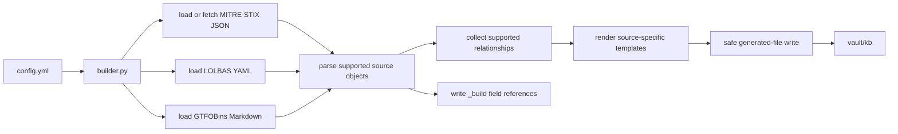

# Focus Locust

Focus Locust is a simple Python builder for an Obsidian security knowledge base.

The builder currently supports MITRE ATT&CK Enterprise, LOLBAS/LOLBins, and GTFOBins. It reads source data, normalises supported records, renders Markdown with source-specific Jinja2 templates, writes indexes for browsing in Obsidian, and creates `_build` reference notes for datasource fields.

## Current Scope

Implemented sources:

- MITRE ATT&CK Enterprise STIX JSON
- tactics, techniques, sub-techniques, mitigations, data sources, and software/tool notes
- LOLBAS / LOLBins YAML from `.cache/lolbas/yml`
- LOLBAS tool notes under `kb/lolbas/tools/`
- GTFOBins Markdown from `.cache/gtfobins/_gtfobins`
- GTFOBins tool notes under `kb/gtfobins/tools/`
- Obsidian Markdown output
- deterministic filenames using `<id>-<lowercase-kebab-slug>.md`
- full-path Obsidian wikilinks
- source-specific templates under `templates/mitre/`, `templates/lolbas/`, and `templates/gtfobins/`
- generated-file overwrite protection
- simple index pages
- `_build` datasource field and template reference pages
- baseline snapshots under `baseline/`

Intentionally excluded:

- SQLite
- graph databases
- AI summaries or enrichment
- Dataview and DataviewJS
- plugin systems
- fuzzy matching
- generated group pages
- campaign pages
- malware pages
- Sigma, Atomic Red Team, PayloadsAllTheThings, and internal Markdown ingestion

Future source work should follow the source-specific parser/template pattern already used by MITRE, LOLBAS, and GTFOBins.

## Pipeline



The CLI entrypoint is `builder.py`.

Main code locations:

- CLI: `builder.py`
- config loading: `src/kb_builder/config.py`
- path validation and directory creation: `src/kb_builder/paths.py`
- cache handling: `src/kb_builder/cache.py`
- MITRE parser: `src/kb_builder/sources/mitre.py`
- LOLBAS parser: `src/kb_builder/sources/lolbas.py`
- GTFOBins parser: `src/kb_builder/sources/gtfobins.py`
- renderer and index generation: `src/kb_builder/render/markdown.py`
- datasource field summaries: `src/kb_builder/build_summary.py`
- templates: `templates/mitre/` and `templates/shared/`
- source templates: `templates/lolbas/` and `templates/gtfobins/`
- safe-write and clean logic: `src/kb_builder/safe_write.py`

## Install

```bash
python3 -m venv venv
source venv/bin/activate
pip install -r requirements.txt
```

## Check Environment

```bash
python3 builder.py doctor --config config.yml
```

`doctor` verifies the config, output paths, and required templates.

## Build

```bash
python3 builder.py build --config config.yml
```

The generated vault is written to:

```text
vault/
```

You can override the vault output path:

```bash
python3 builder.py build --config config.yml --vault ./scratch-vault
```

Enable verbose logs when troubleshooting:

```bash
python3 builder.py build --config config.yml --verbose
```

## Clean

```bash
python3 builder.py clean --config config.yml
```

`clean` deletes only generated Markdown files that contain:

```yaml
parsed_by: focuslocust
```

Manual notes without that marker are preserved.

## Test

```bash
python3 -m pytest
```

Run the tests after changing parser, renderer, naming, safe-write, templates, or config behavior.

## Configuration

The default config is `config.yml`.

Important current settings:

```yaml
vault_path: "./vault"

sources:
  mitre:
    enabled: true
    domain: "enterprise-attack"
    include_tactics: true
    include_techniques: true
    include_subtechniques: true
    include_mitigations: true
    include_data_sources: true
    include_tools: true
    include_groups: false
    include_software: false
    include_malware: false
  lolbins:
    enabled: true
    local_path: ".cache/lolbas/yml"
  gtfobins:
    enabled: true
    local_path: ".cache/gtfobins/_gtfobins"

rendering:
  parsed_marker: "focuslocust"
```

`include_tools` controls generated ATT&CK tool notes under `kb/mitre/attack/software/`. Malware and groups are intentionally not generated as MITRE pages. `sources.lolbins.local_path` points at the cached LOLBAS YAML directory. `sources.gtfobins.local_path` points at the cached GTFOBins Markdown directory.

## Naming

Generated notes use:

```text
<canonical-id>-<lowercase-kebab-slug>.md
```

Examples:

```text
T1003.002-security-account-manager.md
S0002-mimikatz.md
M1027-password-policies.md
certutil.exe.md
tar.md
```

Dots in ATT&CK sub-technique IDs and Windows filenames are preserved.

## Vault Structure

The builder generates content under:

```text
vault/
├── kb/
│   ├── mitre/
│   │   └── attack/
│   │       ├── tactics/
│   │       ├── techniques/
│   │       ├── mitigations/
│   │       ├── data-sources/
│   │       ├── software/
│   │       └── indexes/
│   ├── lolbas/
│   │   └── tools/
│   ├── gtfobins/
│   │   └── tools/
│   ├── _build/
│   └── indexes/
```

Reserved future folders may exist or be created later:

```text
kb/detections/
kb/tests/
kb/payloads/
ws/
```

## Procedure Examples

Procedure examples are built from ATT&CK `uses` relationships where the target is a technique or sub-technique and the source ATT&CK ID starts with `S`.

Current behavior:

- software/tool examples are included
- malware examples are included because MITRE malware IDs also use `S...`
- group examples are excluded
- campaign examples are excluded
- if a referenced object exists in the generated link map, the ID is rendered as a local Obsidian wikilink
- if the source is malware and no local page exists, the ID is rendered as an external MITRE ATT&CK link
- if no local target exists and no malware URL is available, the ID remains plain text

This keeps generated procedure tables useful without creating broken local links to pages the baseline does not generate.

## References

Object and relationship references are collected from ATT&CK external references. `mitre-attack` references are used for IDs and URLs but are not emitted as local footnotes. Citation markers in descriptions are converted to footnotes when the source exists in the object or relationship references.

An all-references index is generated at:

```text
vault/kb/mitre/attack/indexes/all-references.md
```

## Generated-File Safety

Generated Markdown files include:

```yaml
parsed_by: focuslocust
```

The builder may only overwrite or delete files containing that marker. If a target Markdown file already exists without the marker, the builder skips it and logs a warning.

This is the main safety rule for working in an Obsidian vault that may also contain manual notes.

## Build Reference Notes

Every build writes datasource reference notes under:

```text
vault/kb/_build/
```

`datasource-fields.md` lists raw datasource properties, observed types, counts, and sample values. Example object pages under `_build/objects/` show Jinja access expressions for representative MITRE, LOLBAS, and GTFOBins objects.

Example Jinja raw-field access:

```jinja
{{ obj.raw | field_value("Name") }}

- {{ handle }}

```

## Baselines

The current accepted vault snapshot is:

```text
baseline/01/
```

It was created from the generated `vault/` directory after the procedure-example decisions above. At creation time, both directories contained 971 files.

Use baselines as comparison snapshots before changing parser, renderer, template, or config behavior. To create a future baseline:

```bash
mkdir -p baseline
cp -a vault baseline/02
```

Choose the next numeric directory manually. Do not overwrite an existing baseline unless that is the explicit task.

## Documentation

- [Usage](docs/usage.md)
- [Architecture](docs/architecture.md)
- [Templates](docs/templates.md)
- [Adding a Source](docs/adding-a-source.md)
- [Troubleshooting](docs/troubleshooting.md)

## Templates

Each source has its own templates. The current build uses:

```text
templates/mitre/tactic.md.j2
templates/mitre/technique.md.j2
templates/mitre/mitigation.md.j2
templates/mitre/data-source.md.j2
templates/mitre/tool.md.j2
templates/mitre/index.md.j2
templates/lolbas/tool.md.j2
templates/lolbas/index.md.j2
templates/gtfobins/tool.md.j2
templates/gtfobins/index.md.j2
templates/build/object-properties.md.j2
```

Use source-specific templates for future sources rather than adding cross-source conditionals to existing templates.

## Development Rules

Keep implementation simple:

- Python only
- no SQLite
- no graph database
- no AI layer
- no Dataview or DataviewJS
- source-specific templates
- deterministic naming
- safe generated-file overwrites only

Before finishing a change:

```bash
python3 -m pytest
```

For final vault regeneration, run:

```bash
python3 builder.py build --config config.yml
```

## Git Setup

To initialise this repository:

```bash
git init
git add .
git commit -m "Initial baseline"
```

If Git asks for identity:

```bash
git config user.name "Your Name"
git config user.email "you@example.com"
```

To add a remote:

```bash
git remote add origin <repo-url>
git branch -M main
git push -u origin main
```
