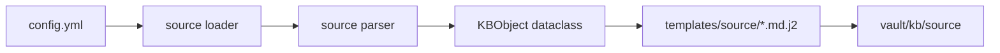

# Adding A Source

MITRE and LOLBAS are implemented. Future sources should follow the same source-specific pattern.



## Steps

1. Add source config under `sources:` in `config.yml`.
2. Add a parser under `src/kb_builder/sources/`.
3. Preserve raw source records on `obj.raw`.
4. Render to a source-specific folder under `vault/kb/<source>/`.
5. Add source-specific templates under `templates/<source>/`.
6. Add indexes under `vault/kb/indexes/`.
7. Reuse `safe_write_text()`.
8. Add parser and renderer tests.

## Rules

- Keep paths inside the repository.
- Use source-specific templates.
- Use normal Markdown and Obsidian wikilinks.
- Do not add SQLite, graph databases, AI, Dataview, or DataviewJS.
- Generated files must contain `parsed_by: focuslocust`.

## Future Source Notes

Not implemented yet:

- Sigma
- Atomic Red Team
- PayloadsAllTheThings
- GTFOBins
- internal Markdown repositories

Each future source should keep its own folder, for example:

```text
kb/sigma/
kb/atomic/
kb/payloadsallthethings/
kb/gtfobins/
```
