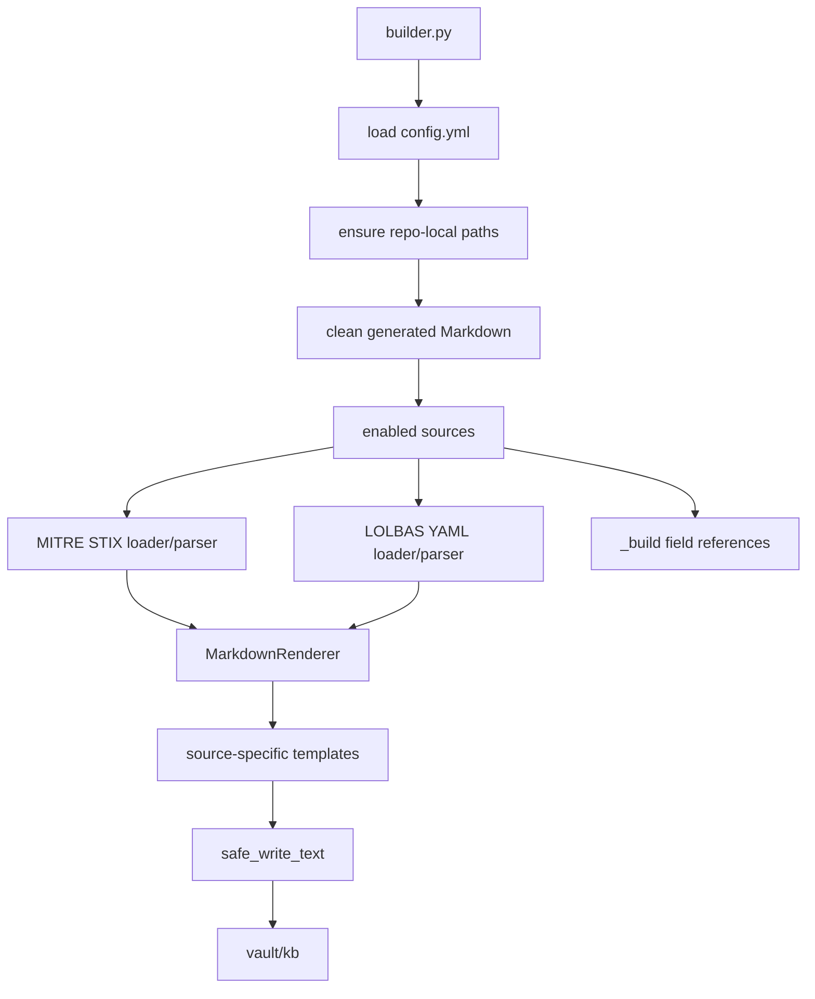

# Architecture

Focus Locust is a source-specific Markdown builder for an Obsidian security knowledge base.



## Code Map

| Area | File | Notes |
| --- | --- | --- |
| CLI | `builder.py` | Commands: `build`, `clean`, `doctor`. |
| Config | `src/kb_builder/config.py` | Loads YAML config from inside the repo. |
| Paths | `src/kb_builder/paths.py` | Creates vault, cache, log, and source folders. |
| Safe write | `src/kb_builder/safe_write.py` | Overwrites/deletes only generated files. |
| MITRE cache | `src/kb_builder/cache.py` | Loads local/cache/remote MITRE STIX JSON. |
| MITRE parser | `src/kb_builder/sources/mitre.py` | Parses ATT&CK objects and relationships. |
| LOLBAS parser | `src/kb_builder/sources/lolbas.py` | Parses LOLBAS YAML from `.cache/lolbas/yml`. |
| Renderer | `src/kb_builder/render/markdown.py` | Renders Markdown and registers Jinja filters. |
| Build refs | `src/kb_builder/build_summary.py` | Writes `_build` datasource field references. |

## Current Sources

MITRE ATT&CK Enterprise generates:

- `kb/mitre/attack/tactics/`
- `kb/mitre/attack/techniques/`
- `kb/mitre/attack/mitigations/`
- `kb/mitre/attack/data-sources/`
- `kb/mitre/attack/software/`
- `kb/mitre/attack/indexes/`

LOLBAS generates:

- `kb/lolbas/tools/`
- `kb/indexes/lolbas.md`

Build reference pages generate:

- `kb/_build/datasource-fields.md`
- `kb/_build/objects/<source>/<type>/example-*.md`

## Safety Model

Generated files contain:

```yaml
parsed_by: focuslocust
```

`clean` and `build` only delete or overwrite files containing that marker. Manual notes are skipped.
