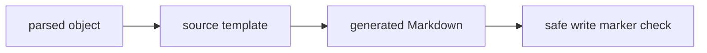

# Templates

Focus Locust uses Jinja2 templates. Templates are source-specific.

Current implemented template folders:

```text
templates/
├── build/
├── gtfobins/
├── lolbas/
├── mitre/
└── shared/
```



## MITRE Templates

```text
templates/mitre/tactic.md.j2
templates/mitre/technique.md.j2
templates/mitre/mitigation.md.j2
templates/mitre/data-source.md.j2
templates/mitre/tool.md.j2
templates/mitre/index.md.j2
```

## LOLBAS Templates

```text
templates/lolbas/tool.md.j2
templates/lolbas/index.md.j2
```

LOLBAS templates render normalized fields such as `obj.name`, `obj.commands`, and `obj.path`, and can also access preserved raw YAML through `obj.raw`.

## GTFOBins Templates

```text
templates/gtfobins/tool.md.j2
templates/gtfobins/index.md.j2
```

GTFOBins templates render normalized fields such as `obj.name`, `obj.functions`, `obj.function_examples`, and `obj.path`, and can also access preserved source frontmatter through `obj.raw`.

## Build Templates

```text
templates/build/object-properties.md.j2
```

This template renders representative `_build` object-property examples. The example object for each group is selected by the largest number of raw datasource fields.

## Raw Field Access

The renderer provides these filters:

```jinja
{{ obj.raw | field_value("Name") }}


- {{ handle }}

```

Use `_build` pages to discover paths:

```text
vault/kb/_build/datasource-fields.md
vault/kb/_build/objects/
```

## YAML Frontmatter

Use `yaml_quote` for frontmatter values that may contain backslashes or special characters:

```jinja
paths:

  - {{ value | yaml_quote }}

```

Generated templates must include:

```yaml
parsed_by: {{ parsed_marker }}
```
