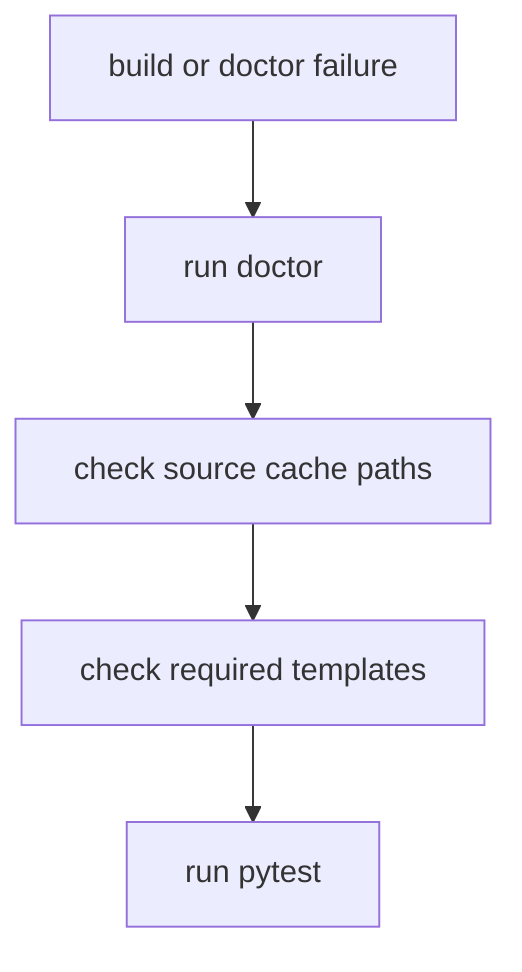

# Troubleshooting

## Run Checks



```bash
python3 builder.py doctor --config config.yml
python3 -m pytest
```

## Build Command

```bash
python3 builder.py build --config config.yml
```

## Manual File Skipped

Message:

```text
Skipped ... because it does not contain parsed_by marker
```

The target file exists but does not contain:

```yaml
parsed_by: focuslocust
```

The builder preserves it as a manual note. If it is an old generated artifact, inspect it before deleting or adding the marker.

## LOLBAS Cache Missing

LOLBAS expects:

```text
.cache/lolbas/yml
```

If missing, clone or refresh the LOLBAS repo inside `.cache/lolbas`.

## GTFOBins Cache Missing

GTFOBins expects:

```text
.cache/gtfobins/_gtfobins
```

If missing, clone or refresh the GTFOBins repository inside `.cache/gtfobins`.

## PayloadsAllTheThings Cache Missing

PayloadsAllTheThings expects:

```text
.cache/payloadsallthethings
```

If missing, clone or refresh the PayloadsAllTheThings repository inside `.cache/payloadsallthethings`.

## InternalAllTheThings Cache Missing

InternalAllTheThings expects:

```text
.cache/internalallthethings/docs
```

If missing, clone or refresh the InternalAllTheThings repository inside `.cache/internalallthethings`.

## HackTricks Cache Missing

HackTricks expects:

```text
.cache/hacktricks/src
```

If missing, clone or refresh the HackTricks repository inside `.cache/hacktricks`.

## YAML Frontmatter Errors

Windows paths must be YAML-escaped in templates with `yaml_quote`.

Correct:

```jinja
- {{ value | yaml_quote }}
```

Avoid raw double-quoted Windows paths in frontmatter.

## Inspect Raw Fields

Use:

```text
vault/kb/_build/datasource-fields.md
vault/kb/_build/objects/
```

These files show datasource properties, sample data, and Jinja examples.
