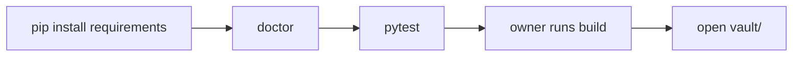

# Usage

## Install



```bash
python3 -m venv venv
source venv/bin/activate
pip install -r requirements.txt
```

## Doctor

```bash
python3 builder.py doctor --config config.yml
```

`doctor` checks config, output paths, source settings, and required templates.

## Test

```bash
python3 -m pytest
```

Run tests after changing parsers, renderers, templates, path handling, build summaries, or safe-write behavior.

## Build

```bash
python3 builder.py build --config config.yml
```

Agents should not run this build command automatically unless explicitly requested. They should run tests and give this command to the project owner.

Build currently processes enabled MITRE, LOLBAS, GTFOBins, PayloadsAllTheThings, and InternalAllTheThings sources.

Default source settings:

```yaml
sources:
  mitre:
    enabled: true
  lolbins:
    enabled: true
    local_path: ".cache/lolbas/yml"
  gtfobins:
    enabled: true
    local_path: ".cache/gtfobins/_gtfobins"
  payloadsallthethings:
    enabled: true
    local_path: ".cache/payloadsallthethings"
  internalallthethings:
    enabled: true
    local_path: ".cache/internalallthethings/docs"
```

## Clean

```bash
python3 builder.py clean --config config.yml
```

`clean` removes generated Markdown files only when they contain:

```yaml
parsed_by: focuslocust
```

## Open In Obsidian

Open `vault/` as the Obsidian vault.

Useful starting points:

- `vault/kb/indexes/mitre.md`
- `vault/kb/indexes/lolbas.md`
- `vault/kb/indexes/gtfobins.md`
- `vault/kb/indexes/payloadsallthethings.md`
- `vault/kb/indexes/internalallthethings.md`
- `vault/kb/_build/datasource-fields.md`

## Cache

MITRE STIX JSON is cached under `.cache/mitre/`.

LOLBAS has been cloned under:

```text
.cache/lolbas/
```

The active LOLBAS YAML directory is:

```text
.cache/lolbas/yml
```

GTFOBins has been cloned under:

```text
.cache/gtfobins/
```

The active GTFOBins source directory is:

```text
.cache/gtfobins/_gtfobins
```

PayloadsAllTheThings has been cloned under:

```text
.cache/payloadsallthethings/
```

InternalAllTheThings has been cloned under:

```text
.cache/internalallthethings/
```

The active InternalAllTheThings source directory is:

```text
.cache/internalallthethings/docs
```
